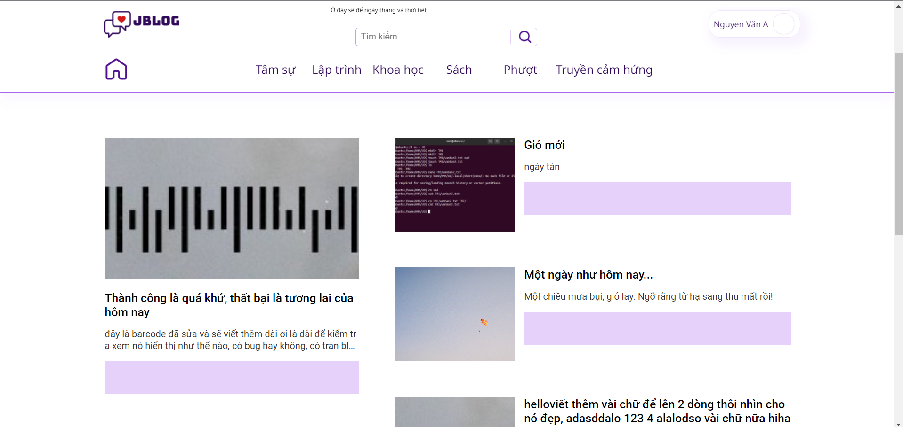
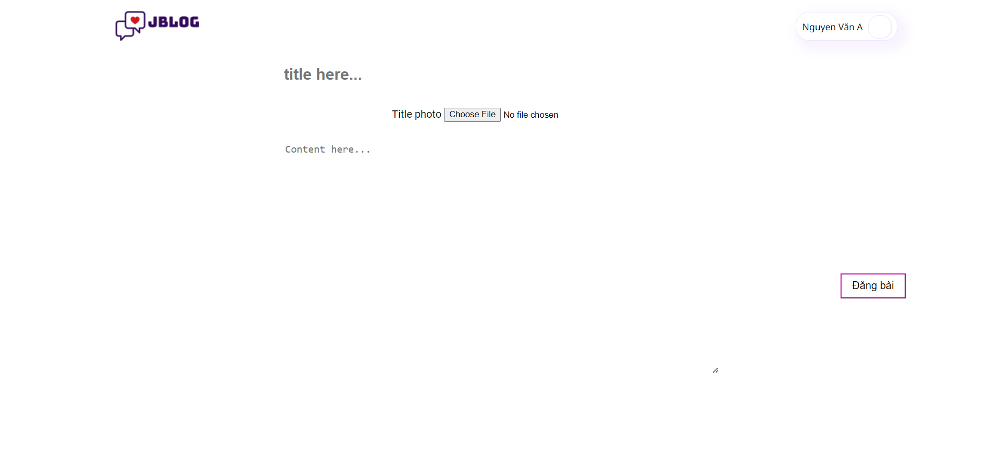
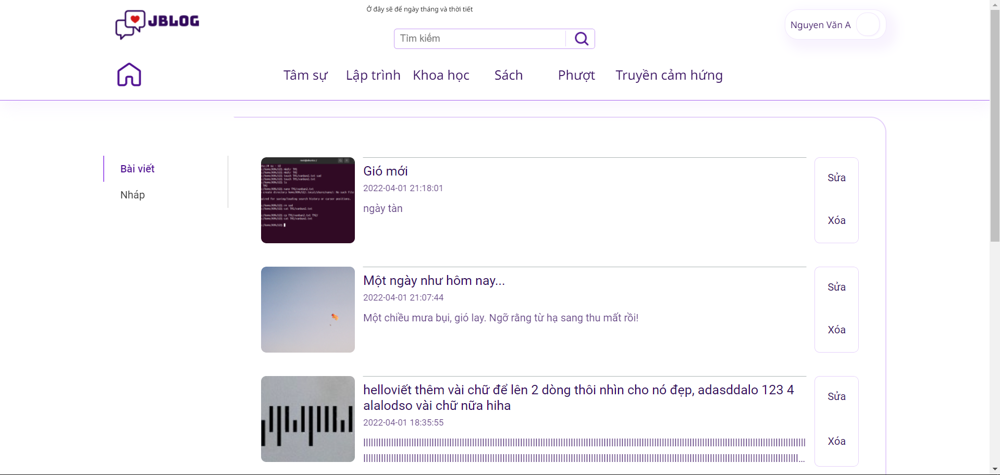

# `jblog`
is Blog platforms are built with pure PHP, not have OOP.
## Built with
- PHP pure (mysqli...).
- [PHPMailer](https://github.com/PHPMailer/PHPMailer) library.
- HTML/CSS, yeah, is surely needed when building web applications.
- A few Javascript codes.
# Run it
How to run it?
  - I recommend running on Laragon or Xampp has PHP 7.4, PHPMyAdmin 5.7.33, and webserver application (ex: Apache, Nginx,...) to ensure at least bugs.
  - Import SQL file into PHPMyAdmin, database name is `jblog`.
  - Start web application on localhost along with port corresponding (ex: localhost:80).

# Demo
- Homepage

- Create post

- Your posts

# Incomplete
Sorry for my incomplete product, and I think I don't intend to complete it because from the beginning I didn't go right in the direction. So, my code is very messy... and I had decided to `pause`.
